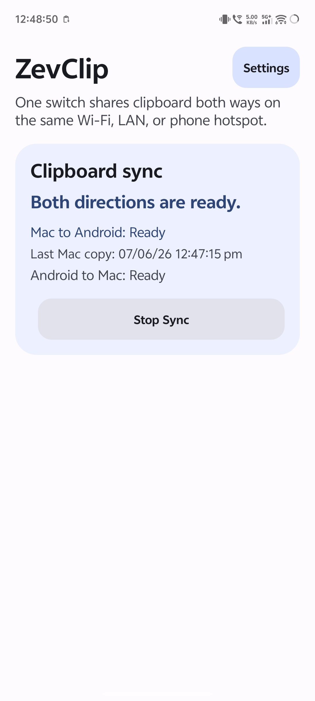
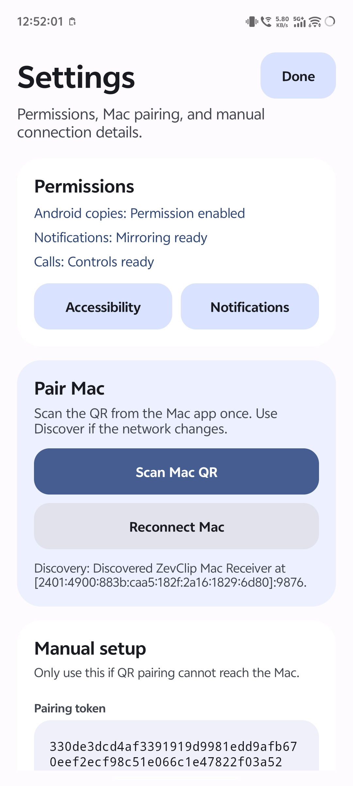
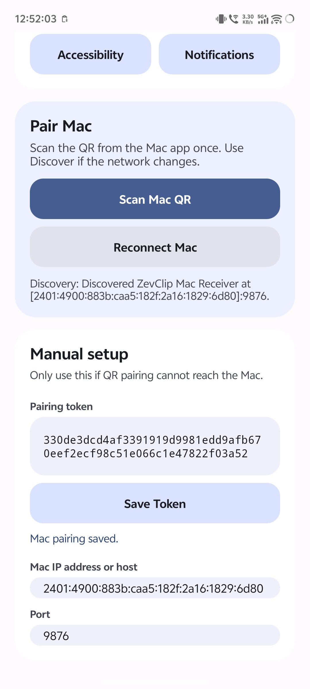
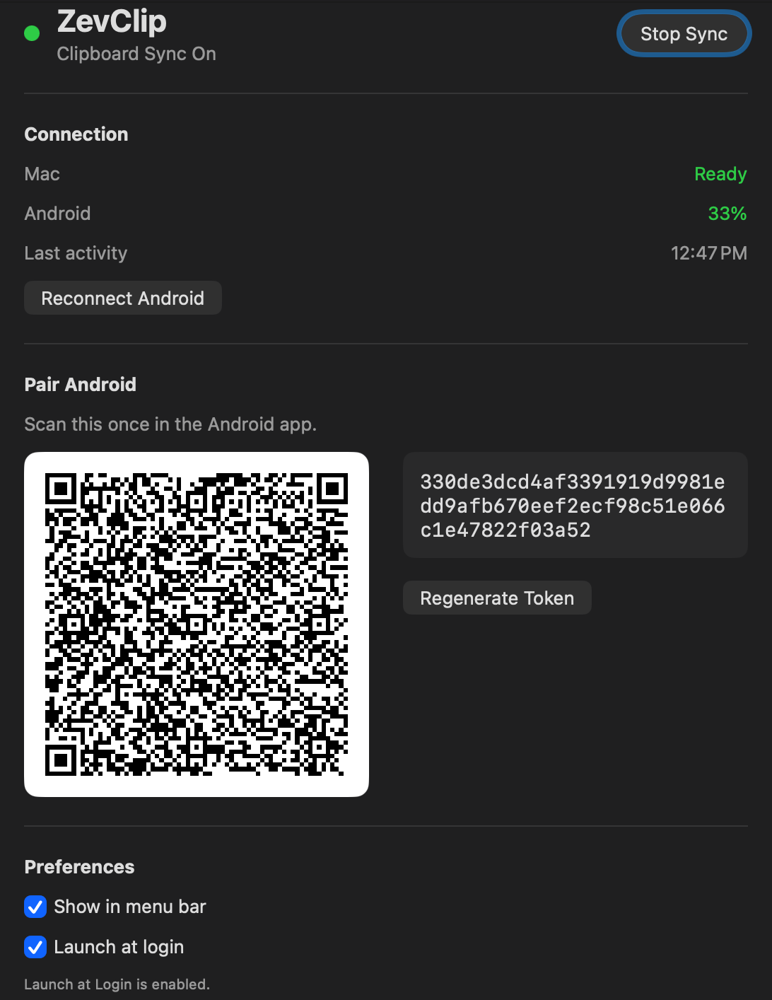

# ZevLink

Local-first Android and Mac continuity: clipboard sync, AirPlay, notification mirroring, call controls, and battery/status presence on your own network.

ZevLink is for people who use an Android phone with a Mac and want the useful cross-device conveniences of a single ecosystem without sending clipboard, notification, or call data through a cloud relay.

It works over the same Wi-Fi/LAN, including a phone hotspot. Pair once with the QR code in the Mac app, then use the Android app home screen to run clipboard sync or AirPlay.

<table>
  <tr>
    <td></td>
    <td></td>
    <td></td>
    <td></td>
  </tr>
</table>

[](https://www.youtube.com/watch?v=ZQB1X4zhDOA)

## What It Does

- Syncs clipboard text from Android to Mac.
- Syncs clipboard text from Mac to Android.
- Mirrors Android screen to Mac with AirPlay.
- Streams Android audio to Mac or AirPlay receivers.
- Mirrors Android notifications as native macOS notifications.
- Lets you accept, reject, silence, and end Android calls from the Mac.
- Shows Android battery percentage in the macOS menu bar when connected.
- Shows Mac connection/battery status in the Android notification.
- Reconnects across Wi-Fi/hotspot changes using Bonjour/mDNS.
- Uses local network communication only. No cloud account, no relay server.

## Downloads

Latest release: **2.0.0**.

Download builds from GitHub Releases.

## Requirements

### Mac

- macOS 14 or newer recommended.
- Local network permission for ZevLink.
- AirPlay Receiver enabled on the Mac for Android screen/audio AirPlay.

### Android

- Android 8.0+ for clipboard, notifications, calls, and local networking.
- Android 10+ for Android audio/screen capture features.
- Google Play services for QR code scanning.
- Accessibility permission for automatic Android to Mac clipboard sync.
- Notification access for notification mirroring.
- Phone permissions for call controls.
- Microphone/audio recording permission for AirPlay audio and screen mirroring.
- Optional: Auto-start or unrestricted battery access on some phones so ZevLink can restart after reboot.

## Quick Setup

1. Install ZevLink on Mac.
2. Open ZevLink Settings from the menu bar.
3. Install ZevLink on Android.
4. Open Android Settings inside ZevLink.
5. Tap **Scan Mac QR** and scan the QR code shown on the Mac.
6. Enable the Android permissions shown in the app.
7. Use the Android home screen for **Clipboard** and **AirPlay**.

Both devices must be on the same local network. A phone hotspot works too: connect the Mac to the phone hotspot, then pair or reconnect.

## AirPlay

ZevLink can start AirPlay directly from the Android home screen:

- **AirPlay Screen to Mac** mirrors the Android screen to the paired Mac.
- **AirPlay Audio to Mac** streams Android audio to the Mac.
- **AirPlay Audio Broadcast** can stream Android audio to selected AirPlay receivers.

For screen mirroring, macOS may show an AirPlay one-time code. After tapping **AirPlay Screen to Mac**, ZevLink opens an **AirPlay One-Time Code** dialog on Android; enter the code shown on the Mac, then approve Android screen capture.

AirPlay audio and audio broadcast start from the Android app without a separate Mac password prompt. If a receiver rejects an audio session, check the receiver's AirPlay settings on that device.

## How Pairing Works

ZevLink uses two local receivers:

- The Mac receiver listens for Android clipboard, notification, call, now-playing, and presence messages.
- The Android receiver listens for Mac clipboard and notification/call actions.

Discovery uses Bonjour/mDNS:

- Mac advertises `_zevclip._tcp`.
- Android advertises `_zevclip-android._tcp`.

The service names now use ZevLink, while the service types remain `_zevclip...` for compatibility with existing installs.

Pairing uses a shared token:

- The Mac generates a pairing token and stores it in Keychain.
- Android stores the token in private app preferences.
- Requests include `X-ZevClip-Token` for compatibility.
- Requests with a missing or wrong token are rejected.

## Privacy And Security

ZevLink is local-first:

- No ZevLink cloud server.
- No account.
- No analytics.
- Clipboard, notification, call, and presence data are sent directly between your paired Android phone and Mac.

Security limitations:

- Clipboard/control traffic uses plain HTTP on your local network.
- The pairing token prevents random local devices from sending accepted requests, but it is not end-to-end encryption.
- Use ZevLink on trusted networks.
- For remote use, a private VPN such as Tailscale can be added later as an optional fallback, but local Wi-Fi/hotspot remains the default path.

## Current Limitations

- Android to Mac clipboard sync can be limited by Android/OEM clipboard restrictions.
- Text clipboard sync is supported. Image clipboard sync is planned for a later version.
- macOS public distribution needs Developer ID signing and notarization.
- Some Android brands may block boot autostart unless Auto-start or unrestricted battery is enabled manually.
- Bonjour discovery may fail on networks with client isolation enabled. Reconnect from Android Settings after moving between Wi-Fi, LAN, or hotspot networks.

## Build From Source

### macOS

Open `ZevClip.xcodeproj` in Xcode and run the `ZevClip` scheme. The product builds as `ZevLink.app`.

The helper script can run debug builds when Xcode is configured:

```sh
./script/build_and_run.sh
```

### Android

Build the Android debug APK:

```sh
cd android
./gradlew :app:assembleDebug
```

Install on a connected device:

```sh
cd android
./gradlew :app:installDebug
```

Build the Android release APK:

```sh
cd android
./gradlew :app:assembleRelease
```

Release APKs must be signed with a release keystore before sharing as a final build.

## Local API

Android to Mac clipboard:

```http
POST /clipboard
X-ZevClip-Token: <pairing-token>
Content-Type: text/plain; charset=utf-8

Hello from Android
```

Mac to Android uses the Android receiver endpoint saved during pairing and presence updates.

## Roadmap

- Two-way image clipboard sync.
- Optional Tailscale fallback mode for remote sync when both devices are on the same tailnet.
- Cleaner signed/notarized macOS release pipeline.
- Better onboarding for Android battery/autostart settings.

## Contributing

See [CONTRIBUTING.md](CONTRIBUTING.md) for setup, testing, issue, and pull request guidelines.

Helpful feedback includes:

- Phone model and Android version.
- macOS version.
- Whether you are on Wi-Fi, LAN, hotspot, or VPN.
- What permission or reconnect state failed.
- Logs or screenshots if available.
